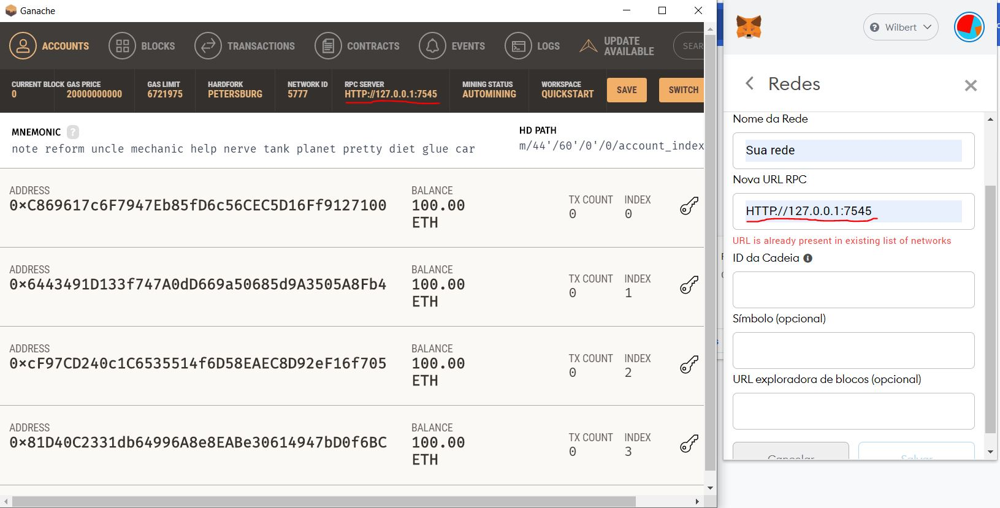
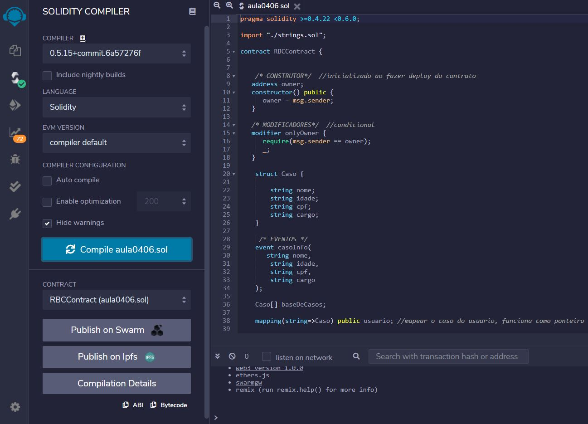
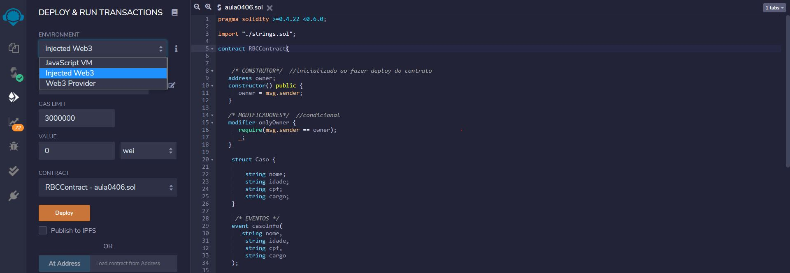
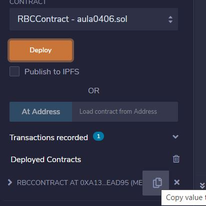
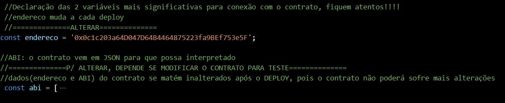
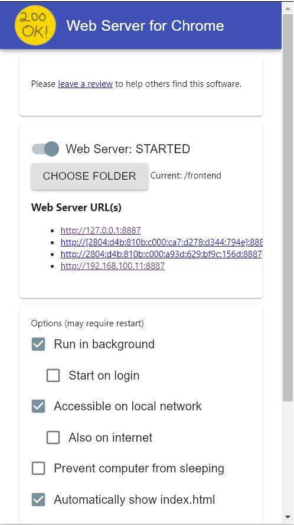

<h1 align="center">myRegister</h1>

  

 

### Tópicos 

:small_blue_diamond: [Tecnologias](#tecnologia)

:small_blue_diamond: [Projeto](#projeto)

:small_blue_diamond: [Features](#features)

:small_blue_diamond: [Execução](#execução-de-teste)

:small_blue_diamond: [Links Úteis](#links-úteis)

## Tecnologia

Esse projeto foi desenvolvido com as seguintes tecnologias:

- [Npm](https://nodejs.org/en/)
- [VsCode(opcional)](https://code.visualstudio.com/)
- [Ganache](https://www.trufflesuite.com/ganache)
- [Remix IDE(rodar no site)](https://remix.ethereum.org/)
- [Web3JS(lib no projeto)](https://github.com/WilbertMarins/Ocean_2021/blob/main/Reg%20system/frontend/js/web3.min.js)
- [Metamask](https://chrome.google.com/webstore/detail/metamask/nkbihfbeogaeaoehlefnkodbefgpgknn)
- [Live Server](https://marketplace.visualstudio.com/items?itemName=ritwickdey.LiveServer)
- [Web Server for Chrome](https://chrome.google.com/webstore/detail/web-server-for-chrome/ofhbbkphhbklhfoeikjpcbhemlocgigb)

## Projeto

O "My register" é um sistema desenvolvido com intuito de fornecer uma visão inicial acerca do desenvolvimento de aplicações descentralizadas para a Blockchain Ethereum. Onde utilizamos alguns conceitos fundamentais para a elaboração do contrato inteligente e realizamos a comunição com o frontend. O projeto apresentado aqui é uma extensão do projeto passado com refatoração de código, novos detalhes visuais e algumas alterações no contrato.

### Features

- [x] Cadastro de usuários
- [x] Consulta dos usuários
- [x] Hash do usuário (chave primária na aplicação)

## Execução de teste
- Abrir o Ganache(Modo quickstart)

- Conectar o Metamask criando sua rede local
  

  
  

   

- Efetuar deploy do contrato a partir do RemixIDE
  * Copiar os contratos e seus respectivos nomes devido a questão de dependência
  * Compilar o contrato "aula09_11_21.sol"
  

  
  

   
  
  * Utilizar Inject Web3
  

  
  

   
  
  * Copiar o hash do contrato
  

  
  

   
    
- Atualizar o valor da sua variável("Endereço" como o hash após o deploy) no script ddo contrato: "contrato.js"
  

  
  

   

- Levantar o servidor local
  * Com WEB Server for Chrome: escolha o diretório do seu frontend  
  

  
  

     
    * Com Live Server: Acesse uma das páginas e clique no icone "Go Live " no canto inferior esquerdo.

 

## Links Úteis
- [Artigo sobre o Bitcoin](https://bitcoin.org/bitcoin.pdf)
- [Curso de solidity CryptoZombies](https://cryptozombies.io/pt/)
